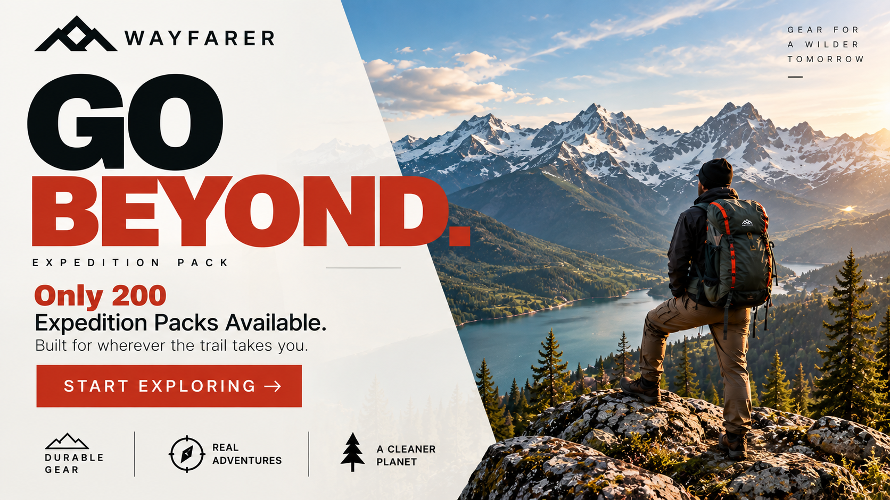
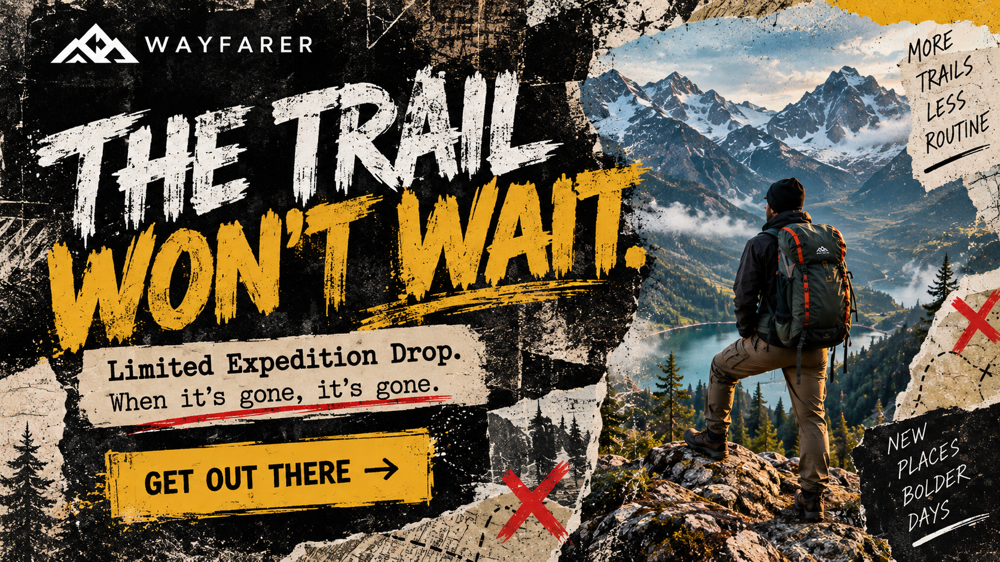
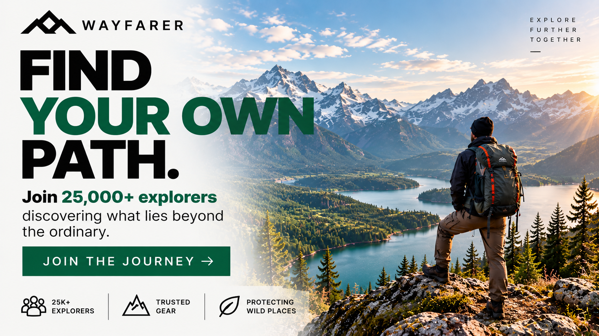
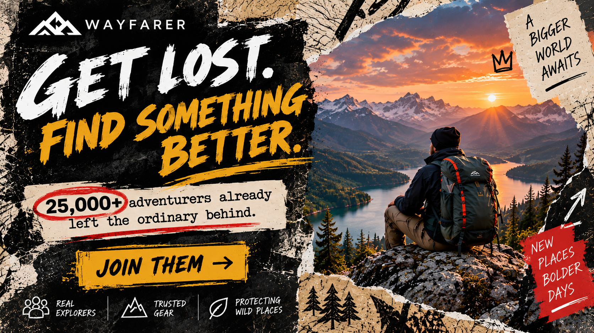

# The Explorer Archetype

## What It Is

The Explorer is a brand archetype centered around freedom, independence,
discovery, adventure, and new experiences. Explorer brands encourage their
audiences to leave familiar environments, experience something new, and
discover more about themselves and the world around them.

The Explorer archetype appeals to people who value independence and do not
want to feel restricted. Its message is often about creating your own path
instead of simply following others.

---

## Audience Motivations

People who are attracted to the Explorer archetype are often motivated by:

- Freedom and independence
- Adventure
- Discovery
- New experiences
- Personal growth
- Escaping routine
- Exploring nature
- Creating their own path

The Explorer audience wants to experience something beyond ordinary daily
life. Brands using this archetype can appeal to that desire by presenting
their product or service as something that enables exploration, independence,
or discovery.

---

## When to Use It

The Explorer archetype works well for brands that want to promote adventure,
independence, discovery, or personal freedom.

It is commonly associated with brands related to:

- Travel and tourism
- Outdoor activities
- Vehicles
- Sports and recreation
- Adventure equipment
- Outdoor clothing
- Lifestyle products

A brand may choose the Explorer archetype when it wants customers to associate
its products or services with discovering new experiences and having greater
freedom.

---

## Visual and Verbal Cues

### Imagery

Explorer brands often use imagery involving:

- Mountains
- Forests
- Open roads
- Trails
- Oceans
- Camping
- Hiking
- Travel
- Large outdoor environments

Large landscapes can communicate freedom and the idea that there is more of
the world waiting to be discovered.

Images of individuals hiking, traveling, climbing, or looking toward distant
landscapes can reinforce the idea of independence and exploration.

### Colors

Colors associated with nature and the outdoors can support an Explorer brand
identity.

Examples include:

- Green
- Brown
- Blue
- Gray
- Tan
- White

These colors can create associations with nature, travel, wilderness, and
outdoor environments.

### Typography

Explorer brands can use strong and easy-to-read typography. Bold sans-serif
fonts can create a modern and confident appearance.

Typography may also become rougher or more expressive when the brand wants to
emphasize wilderness, ruggedness, or unconventional adventure.

### Wording and Tone

Explorer language should encourage independence, curiosity, adventure, and
discovery.

Example phrases include:

- "Find your own path."
- "Discover what is out there."
- "Explore beyond the ordinary."
- "Go beyond."
- "Your next adventure starts here."

The tone should feel adventurous, confident, independent, and curious.

---

## Real-World Brand Example: The North Face

The North Face is an example of a brand that demonstrates characteristics of
the Explorer archetype. The company produces clothing and equipment for
activities such as hiking, climbing, trail running, camping, and other forms
of outdoor recreation.

The brand's connection with outdoor environments and exploration makes it a
useful example of the Explorer archetype. Its products are frequently
presented in the context of outdoor experiences, which can associate the
brand with adventure, discovery, and going beyond familiar environments.

In my interpretation, The North Face demonstrates the Explorer archetype
because the brand does more than present outdoor equipment. Its overall
identity connects the products with the experience of exploring the outdoors
and challenging yourself to experience new places.

---

# Explorer Hero Treatments

For the four hero treatments, I created a fictional outdoor brand called
**WAYFARER**.

Using a fictional brand allows the same Explorer identity to be maintained
while experimenting with different design styles and persuasion principles.

The four treatments use:

**Modernist Design Style:** Swiss / International Typographic Style

**Postmodernist Design Style:** Grunge

**Persuasion Principle A:** Scarcity

**Persuasion Principle B:** Social Proof

The four combinations are:

| Hero | Design Style | Persuasion Principle |
| --- | --- | --- |
| Hero 1 | Swiss / International Style | Scarcity |
| Hero 2 | Grunge | Scarcity |
| Hero 3 | Swiss / International Style | Social Proof |
| Hero 4 | Grunge | Social Proof |

---

## Hero 1 — Swiss Style + Scarcity

### Headline

**GO BEYOND.**

### Supporting Copy

Only 200 Expedition Packs available.

Built for wherever the trail takes you.

### Call to Action

**START EXPLORING**

### Archetype Cue

The mountain landscape, backpacker, and phrase "Go Beyond" communicate the
Explorer archetype through ideas of travel, independence, wilderness, and
adventure.

The person looking across the large mountain environment suggests that there
are new places waiting to be discovered.

### Persuasion Mechanism

This treatment uses the Cialdini principle of **Scarcity**.

The statement "Only 200 Expedition Packs available" communicates that the
product has limited availability. This creates urgency because customers may
believe they have a limited opportunity to obtain the product.

### Design Style

This treatment uses characteristics of the **Swiss / International
Typographic Style**.

The design uses:

- Bold sans-serif typography
- Strong visual hierarchy
- A clean layout
- Structured alignment
- Negative space
- Minimal decorative elements

These characteristics create an organized and functional design while the
photography maintains the adventurous Explorer identity.

---

## Hero 2 — Grunge + Scarcity

### Headline

**THE TRAIL WON'T WAIT.**

### Supporting Copy

Limited Expedition Drop.

When it's gone, it's gone.

### Call to Action

**GET OUT THERE**

### Archetype Cue

The mountain environment, backpacker, and references to trails reinforce the
Explorer themes of wilderness, adventure, and leaving normal routines behind.

The phrase "The Trail Won't Wait" encourages the audience to stop waiting and
begin exploring.

### Persuasion Mechanism

This treatment also uses **Scarcity**.

The phrases "Limited Expedition Drop" and "When it's gone, it's gone" make
the availability of the product seem temporary.

The purpose is to create urgency and encourage the audience to act before the
opportunity disappears.

### Design Style

This treatment uses the **Grunge** postmodernist style.

The design includes:

- Distressed textures
- Rough typography
- Torn-paper effects
- Irregular visual elements
- Handwritten details
- An intentionally imperfect layout

The rough appearance works with the Explorer archetype because it creates a
more rugged and unconventional feeling than the clean Swiss treatment.

---

## Hero 3 — Swiss Style + Social Proof

### Headline

**FIND YOUR OWN PATH.**

### Supporting Copy

Join 25,000+ explorers discovering what lies beyond the ordinary.

### Call to Action

**JOIN THE JOURNEY**

### Archetype Cue

The large mountain landscape and individual overlooking the wilderness
communicate independence, exploration, and discovery.

"Find Your Own Path" directly connects with the Explorer's desire for
freedom and individual experiences.

### Persuasion Mechanism

This treatment uses **Social Proof**.

The statement "Join 25,000+ explorers" suggests that a large community of
people already participates in the WAYFARER experience.

Social proof can influence an audience by showing that other people have
already chosen to participate in the experience.

The number used here is fictional and is included only as part of the
fictional WAYFARER advertising concept.

### Design Style

The design again uses the **Swiss / International Typographic Style**.

Characteristics include:

- Bold sans-serif typography
- Clear alignment
- Strong hierarchy
- Minimal visual clutter
- Organized information
- Generous negative space

The structured presentation allows the message and CTA to remain immediately
visible while the landscape photography communicates the Explorer identity.

---

## Hero 4 — Grunge + Social Proof

### Headline

**GET LOST. FIND SOMETHING BETTER.**

### Supporting Copy

25,000+ adventurers already left the ordinary behind.

### Call to Action

**JOIN THEM**

### Archetype Cue

The wilderness imagery and phrase "Get Lost" represent leaving familiar
environments and seeking new experiences.

"Find Something Better" connects exploration with discovery and personal
growth.

These ideas support the Explorer archetype's focus on freedom, adventure,
and experiencing the unknown.

### Persuasion Mechanism

This treatment uses **Social Proof**.

The statement that "25,000+ adventurers already left the ordinary behind"
presents the fictional brand as having an established community of
adventurers.

The CTA "Join Them" strengthens the social-proof message by inviting the
viewer to become part of that community.

The number is fictional and is used only for this fictional advertising
concept.

### Design Style

This treatment uses the **Grunge** postmodernist style.

The design uses:

- Distressed surfaces
- Rough brush typography
- Torn and layered textures
- Irregular composition
- Handwritten elements
- Bold visual contrast

Compared with the Swiss version, this treatment intentionally appears less
structured and more rebellious. That visual approach reinforces the
Explorer's themes of independence and escaping ordinary routines.

---

## Comparison of the Four Treatments

All four hero treatments maintain the same basic Explorer identity through
wilderness imagery, adventurous language, and themes of independence and
discovery.

The design style changes how that identity is presented.

The Swiss treatments communicate exploration through clean layouts,
structured typography, and visual order. The Grunge treatments communicate
the same Explorer identity through rough textures, irregular layouts, and a
more rebellious visual appearance.

The persuasion principle also changes the purpose of the message.

The Scarcity treatments emphasize limited availability and encourage the
viewer to act quickly. The Social Proof treatments instead emphasize a
community of other explorers who have already participated.

This demonstrates how the same brand archetype can remain recognizable while
different design styles and persuasion principles change the presentation and
message.

---

## Sources and Credits

### Archetype Research

- Pearson, Carol S., and Margaret Mark. *The Hero and the Outlaw: Building
  Extraordinary Brands Through the Power of Archetypes*. McGraw-Hill, 2001.

### Persuasion

- Cialdini, Robert B. *Influence: The Psychology of Persuasion*. Harper
  Business.

### Real-World Brand Example

- The North Face. Official company website.
  https://www.thenorthface.com/

### Hero Artwork

The WAYFARER brand is fictional and was created for this assignment.

The four WAYFARER hero concepts were created specifically for this project
with the assistance of OpenAI's image-generation tools. They are not actual
advertisements or claims from an existing company.

The statistics, product availability, Expedition Packs, and other promotional
claims shown in the WAYFARER concepts are fictional and are included only to
demonstrate the selected persuasion principles.

---

## Navigation

[Back to Brand Archetypes](README.md)