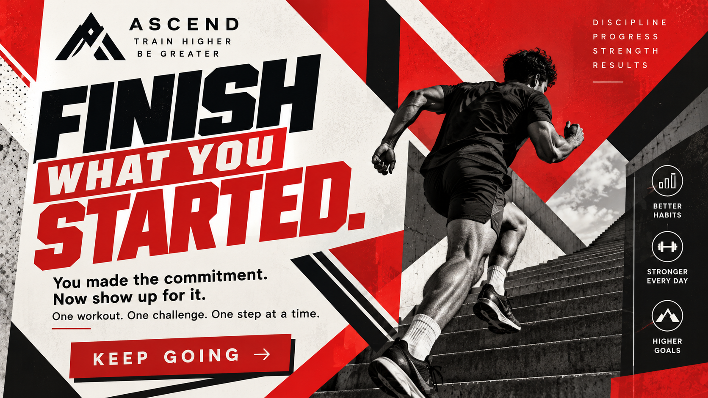
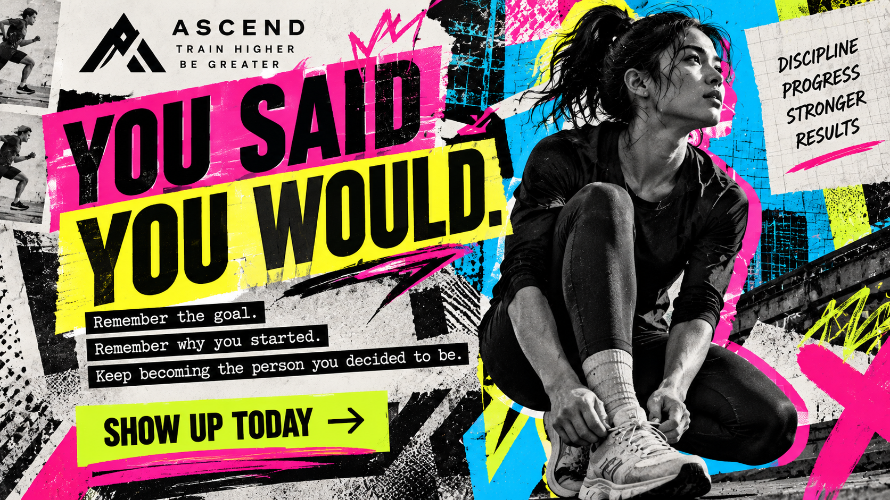
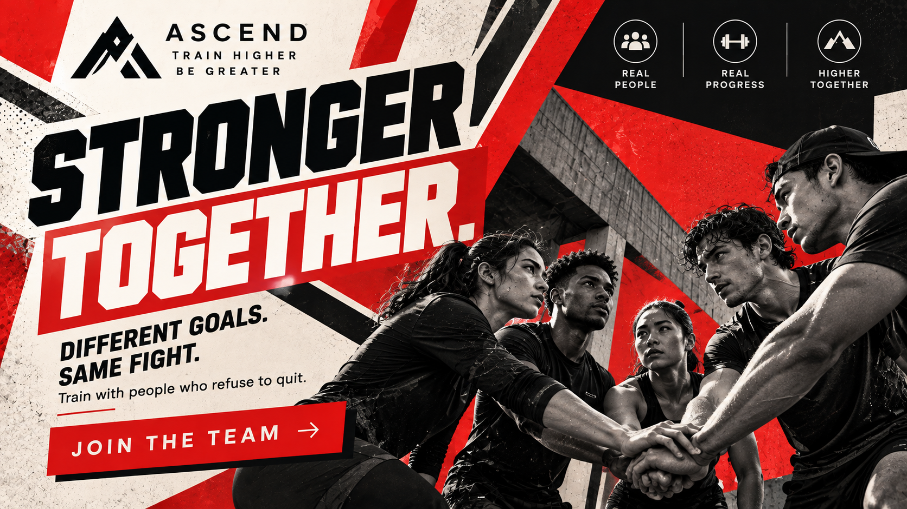
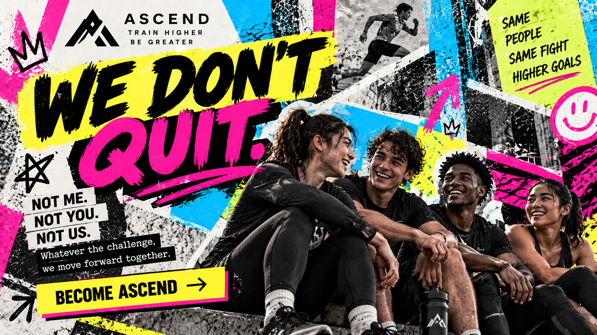

# The Hero Archetype

## What It Is

The Hero is a brand archetype centered around courage, achievement,
determination, strength, and overcoming challenges.

Hero brands encourage their audiences to improve themselves, take action,
and overcome obstacles. Their message often suggests that success is
possible through effort, discipline, and determination.

The Hero archetype appeals to people who want to prove themselves,
accomplish difficult goals, and become stronger or more capable.

---

## Audience Motivations

People attracted to the Hero archetype are often motivated by:

- Achievement
- Personal improvement
- Strength
- Courage
- Competition
- Discipline
- Overcoming challenges
- Accomplishing goals
- Proving themselves

The Hero audience wants to feel capable of overcoming obstacles.

Brands using this archetype can appeal to that motivation by presenting
their products or services as tools that help people improve, perform,
and accomplish difficult goals.

---

## When to Use It

The Hero archetype works well for brands that want to communicate
achievement, determination, strength, or personal improvement.

It is commonly associated with industries such as:

- Sports
- Fitness
- Athletic clothing
- Outdoor activities
- Automobiles
- Technology
- Performance equipment
- Personal development

A brand may use the Hero archetype when it wants customers to associate
its products with overcoming challenges and achieving goals.

---

## Visual and Verbal Cues

### Imagery

Hero brands often use imagery involving:

- Athletes
- Competition
- Training
- Difficult environments
- Physical challenges
- Movement
- Victory
- Determined individuals
- Teams working toward a goal

Images frequently show people taking action rather than remaining passive.

A person running, lifting, climbing, training, or competing can visually
communicate determination and achievement.

### Colors

Hero brands often use strong and energetic colors.

Examples include:

- Red
- Black
- White
- Dark blue
- Orange
- Gray

High contrast can help create a sense of energy, strength, and urgency.

### Typography

Hero brands often use bold typography that communicates confidence and
strength.

Common characteristics include:

- Heavy sans-serif fonts
- Uppercase lettering
- Strong contrast
- Large headlines
- Short statements

Typography should generally feel confident and action-oriented.

### Wording and Tone

Hero language should encourage action, discipline, improvement, and
achievement.

Example phrases include:

- "Rise to the challenge."
- "Become stronger."
- "Keep moving forward."
- "Earn your progress."
- "Push beyond your limits."
- "The work starts now."

The tone should feel motivational, confident, determined, and energetic.

---

## Real-World Brand Example: Nike

Nike demonstrates many characteristics associated with the Hero archetype.

The company sells athletic footwear, clothing, and equipment, and much of
its brand identity is connected with sports, competition, training, and
personal achievement.

Nike's well-known "Just Do It" message encourages action rather than
hesitation.

In my interpretation, Nike demonstrates the Hero archetype because its
advertising frequently presents athletes overcoming challenges, training,
competing, and attempting to improve their performance.

The product is therefore connected with a larger message about effort,
determination, and achievement.

---

# Hero Treatments

For the four Hero treatments, I created a fictional athletic brand called
**ASCEND**.

ASCEND represents a performance brand focused on training, personal
improvement, discipline, and overcoming challenges.

Using a fictional brand allows the Hero identity to remain consistent while
different design styles and persuasion principles are tested.

The four treatments use:

**Modernist Design Style:** Constructivism

**Postmodernist Design Style:** New Wave

**Persuasion Principle A:** Commitment and Consistency

**Persuasion Principle B:** Unity

The four combinations are:

| Hero | Design Style | Persuasion Principle |
| --- | --- | --- |
| Hero 1 | Constructivism | Commitment and Consistency |
| Hero 2 | New Wave | Commitment and Consistency |
| Hero 3 | Constructivism | Unity |
| Hero 4 | New Wave | Unity |

---

## Hero 1 — Constructivism + Commitment and Consistency

### Headline

**FINISH WHAT YOU STARTED.**

### Supporting Copy

You made the commitment.

Now show up for it.

One workout. One challenge. One step at a time.

### Call to Action

**KEEP GOING**

### Archetype Cue

The message emphasizes determination, discipline, and overcoming
difficulty.

"Finish What You Started" communicates the Hero archetype because it
encourages the audience to continue working toward a difficult goal instead
of giving up.

Athletic imagery can reinforce the idea of physical effort, training, and
personal improvement.

### Persuasion Mechanism

This treatment uses Cialdini's principle of **Commitment and Consistency**.

Once people make a commitment, they may feel motivated to behave in ways
that remain consistent with that commitment.

The statement "You made the commitment. Now show up for it" reminds the
viewer of a decision they have already made.

Instead of asking them to begin an entirely new behavior, the message
encourages them to remain consistent with their existing goal.

### Design Style

This treatment uses characteristics inspired by **Constructivism**.

The design can use:

- Strong diagonal lines
- Geometric shapes
- Bold typography
- Red, black, and neutral tones
- Dramatic visual hierarchy
- Dynamic composition
- Action-oriented imagery

The energetic composition reinforces the Hero archetype by making the
advertisement feel powerful and active.

---

## Hero 2 — New Wave + Commitment and Consistency

### Headline

**YOU SAID YOU WOULD.**

### Supporting Copy

Remember the goal.

Remember why you started.

Keep becoming the person you decided to be.

### Call to Action

**SHOW UP TODAY**

### Archetype Cue

The message emphasizes discipline and personal improvement.

The phrase "You Said You Would" challenges the audience to continue pursuing
a goal they previously established.

This reflects the Hero archetype's focus on determination and overcoming
obstacles.

### Persuasion Mechanism

This treatment uses **Commitment and Consistency**.

The message reminds the viewer of a previous commitment and encourages
behavior that remains consistent with it.

"Remember Why You Started" reinforces the idea that the audience has already
chosen a goal.

The CTA "Show Up Today" turns that commitment into a specific action.

### Design Style

This treatment uses characteristics inspired by **New Wave design**.

The design can include:

- Irregular typography
- Unconventional alignment
- Layered text
- Bright contrasting colors
- Diagonal or rotated elements
- Experimental spacing
- Breaking traditional grid structures

Compared with Constructivism, this creates a less predictable and more
experimental interpretation of the Hero identity.

---

## Hero 3 — Constructivism + Unity

### Headline

**STRONGER TOGETHER.**

### Supporting Copy

Different goals. Same fight.

Train with people who refuse to quit.

### Call to Action

**JOIN THE TEAM**

### Archetype Cue

The athletes, strong typography, and action-oriented language communicate
determination and strength.

Instead of presenting the Hero only as an individual, this treatment shows
that challenges can also be overcome as part of a group.

"Stronger Together" connects achievement with teamwork.

### Persuasion Mechanism

This treatment uses Cialdini's principle of **Unity**.

Unity is based on a shared identity between people.

The phrase "Different Goals. Same Fight." presents ASCEND users as members
of a larger group connected through determination and training.

"Join the Team" reinforces this shared identity by inviting the viewer to
see themselves as part of the ASCEND community.

### Design Style

This treatment uses **Constructivism**.

Characteristics can include:

- Strong geometric shapes
- Diagonal composition
- Bold sans-serif typography
- High contrast
- Red and black visual elements
- Dramatic photography
- Strong visual direction

These elements make the advertisement feel energetic and collective while
maintaining the Hero identity.

---

## Hero 4 — New Wave + Unity

### Headline

**WE DON'T QUIT.**

### Supporting Copy

Not me.

Not you.

Not us.

Whatever the challenge, we move forward together.

### Call to Action

**BECOME ASCEND**

### Archetype Cue

The language directly communicates persistence and determination.

"We Don't Quit" is consistent with the Hero archetype because it defines the
brand through the ability to continue despite difficulty.

The use of a group identity also presents achievement as something people
can pursue together.

### Persuasion Mechanism

This treatment uses **Unity**.

The repeated use of "we," "you," and "us" creates a shared identity between
the fictional ASCEND brand and its audience.

Instead of simply asking the audience to purchase a product, the message
invites them to identify as a member of a group that does not give up.

The CTA "Become ASCEND" strengthens that idea by framing participation as
membership in the identity.

### Design Style

This treatment uses the **New Wave** postmodernist style.

The design can use:

- Experimental typography
- Text at unusual angles
- Overlapping elements
- Asymmetrical composition
- Bright contrasting colors
- Broken grid structures
- Expressive graphic elements

The unconventional layout creates energy and movement while distinguishing
the treatment from the more structured Constructivist designs.

---

## Comparison of the Four Treatments

All four treatments maintain the Hero archetype through themes of
determination, achievement, discipline, strength, and overcoming challenges.

The design styles change how those ideas are visually communicated.

The Constructivist treatments use strong geometry, diagonal movement, bold
typography, and dramatic compositions. These characteristics communicate
strength and action in a direct way.

The New Wave treatments use experimental typography, irregular layouts, and
unconventional positioning. This creates a more expressive interpretation of
the same Hero identity.

The persuasion principles also change the message.

Commitment and Consistency focuses on the individual's previous decisions.
The audience is reminded that they already chose a goal and should continue
acting consistently with that choice.

Unity focuses on shared identity. Instead of emphasizing only individual
achievement, the message presents ASCEND users as members of a group that
faces challenges together.

Together, the four treatments demonstrate how one Hero brand can maintain
the same basic identity while changing both its visual design and persuasion
strategy.

---

## Strongest Hero

Of the four treatments, **Hero 3 — Constructivism + Unity** is a strong
representation of the ASCEND concept.

Constructivism's dramatic geometry, bold typography, and emphasis on movement
work naturally with the Hero archetype's themes of action and strength.

Unity also expands the Hero message beyond individual achievement. The
audience is presented as part of a group of people who share determination
and refuse to quit.

Compared with the Commitment and Consistency treatments, Hero 3 focuses less
on reminding an individual of a previous decision and more on creating a
shared identity around achievement.

---

## Sources and Credits

### Archetype Research

- Pearson, Carol S., and Margaret Mark. *The Hero and the Outlaw: Building
  Extraordinary Brands Through the Power of Archetypes*. McGraw-Hill, 2001.

### Persuasion

- Cialdini, Robert B. *Influence: The Psychology of Persuasion*. Harper
  Business.

### Real-World Brand Example

- Nike. Official company website.
  https://www.nike.com/

### Hero Artwork

ASCEND is a fictional athletic brand created for this assignment.

The four ASCEND hero concepts were created specifically for this project
with the assistance of OpenAI's image-generation tools.

ASCEND is not a real company. Products, statistics, testimonials, and other
promotional claims appearing in the concepts are fictional and are included
only to demonstrate the selected design styles and persuasion principles.

---

## Navigation

[Back to Brand Archetypes](README.md)