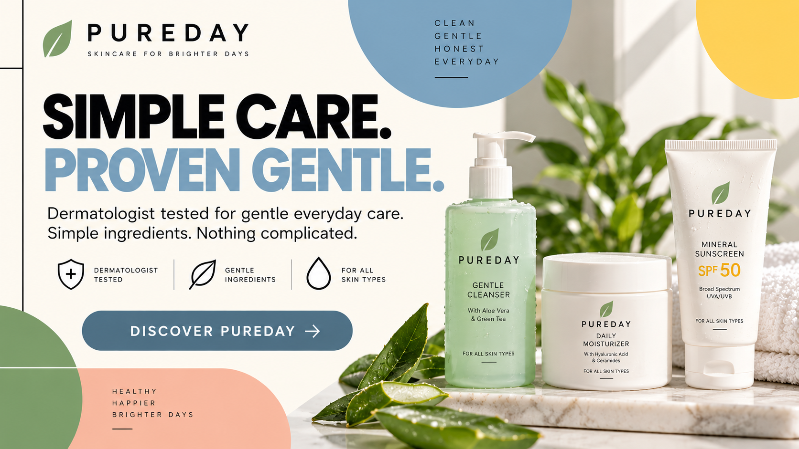
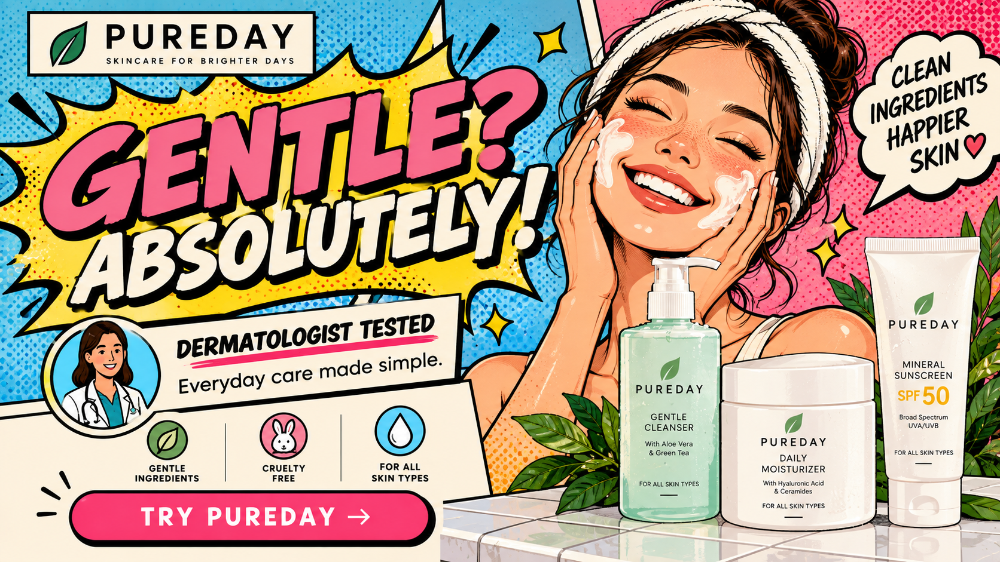
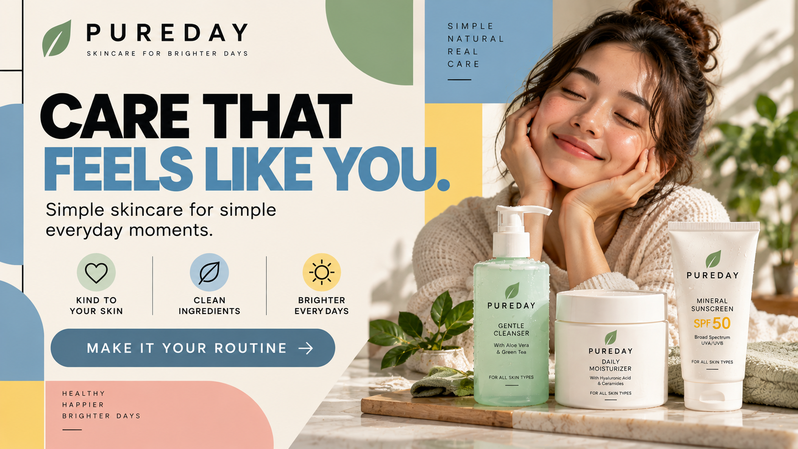
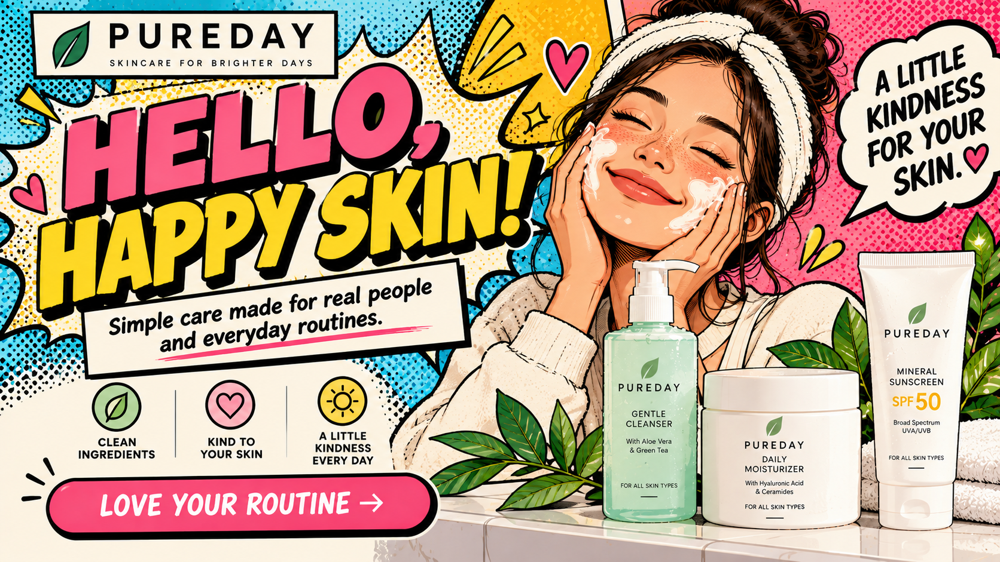

# The Innocent Archetype

## What It Is

The Innocent is a brand archetype centered around optimism, simplicity,
honesty, safety, and happiness. Innocent brands present the world in a
positive and reassuring way and often promise simple solutions without
unnecessary complexity.

The Innocent archetype appeals to people who value trust, comfort,
predictability, and sincerity. These brands often communicate the idea that
life can be simpler, happier, and more enjoyable.

---

## Audience Motivations

People attracted to the Innocent archetype are often motivated by:

- Happiness
- Safety and security
- Simplicity
- Trust
- Honesty
- Comfort
- Positivity
- Peace of mind

The Innocent audience generally wants to feel confident that they are making
a safe and dependable choice.

Brands using this archetype can appeal to that desire by presenting
themselves as transparent, friendly, wholesome, and uncomplicated.

---

## When to Use It

The Innocent archetype works well for brands that want customers to associate
them with trust, happiness, simplicity, or reliability.

It can commonly appear in industries such as:

- Food and beverages
- Personal care
- Skincare
- Family products
- Household products
- Health and wellness
- Children's products

A brand may use the Innocent archetype when it wants its product to feel safe,
familiar, approachable, and easy to understand.

---

## Visual and Verbal Cues

### Imagery

Innocent brands often use imagery involving:

- Nature
- Clean environments
- Families
- Smiling people
- Natural ingredients
- Soft lighting
- Open spaces
- Everyday moments

Images should generally feel welcoming, positive, and uncomplicated.

### Colors

Light and clean colors can help communicate an Innocent identity.

Examples include:

- White
- Light blue
- Yellow
- Light green
- Cream
- Pastel colors

These colors can create associations with cleanliness, happiness, nature,
purity, and simplicity.

### Typography

Innocent brands generally benefit from typography that is clean, friendly,
and easy to read.

Simple sans-serif fonts can communicate clarity and honesty, while softer
letterforms can make the brand appear approachable and welcoming.

### Wording and Tone

The language should be:

- Positive
- Friendly
- Reassuring
- Simple
- Honest
- Optimistic

Example phrases include:

- "Simply good."
- "Made with care."
- "Nothing complicated."
- "A little happiness every day."
- "Simple ingredients. Simple care."

The message should avoid sounding aggressive or intimidating.

---

## Real-World Brand Example: Dove

Dove demonstrates several characteristics associated with the Innocent
archetype. The brand frequently emphasizes care, gentleness, simplicity,
and everyday personal care.

Its advertising often uses clean visual environments and approachable
language rather than presenting its products as extreme or exclusive.

In my interpretation, Dove demonstrates the Innocent archetype because its
brand identity attempts to make personal care feel approachable, reassuring,
and positive.

The focus on care and straightforward messaging supports the Innocent
archetype's themes of trust, comfort, and simplicity.

---

# Innocent Hero Treatments

For these four hero treatments, I created a fictional skincare brand called
**PUREDAY**.

PUREDAY is intended to represent an Innocent brand focused on gentle,
straightforward skincare and positive everyday routines.

The four treatments use:

**Modernist Design Style:** Bauhaus

**Postmodernist Design Style:** Pop Art

**Persuasion Principle A:** Authority

**Persuasion Principle B:** Liking

The four combinations are:

| Hero | Design Style | Persuasion Principle |
| --- | --- | --- |
| Hero 1 | Bauhaus | Authority |
| Hero 2 | Pop Art | Authority |
| Hero 3 | Bauhaus | Liking |
| Hero 4 | Pop Art | Liking |

---

## Hero 1 — Bauhaus + Authority

### Headline

**SIMPLE CARE. PROVEN GENTLE.**

### Supporting Copy

Dermatologist tested for gentle everyday care.

Simple ingredients. Nothing complicated.

### Call to Action

**DISCOVER PUREDAY**

### Archetype Cue

The clean skincare imagery and straightforward language communicate
simplicity, safety, and trust.

The phrase "Simple Care" reinforces the Innocent archetype by presenting
skincare as something uncomplicated and reassuring.

Light colors and clean product imagery further reinforce ideas of purity and
gentleness.

### Persuasion Mechanism

This treatment uses Cialdini's principle of **Authority**.

The statement "Dermatologist tested" provides an authority cue by connecting
the fictional product with professional expertise.

Rather than relying only on the brand's own claims, the message suggests that
the product has been evaluated by people with relevant expertise.

Because PUREDAY is fictional, this statement is used only to demonstrate the
Authority principle for the assignment.

### Design Style

This treatment uses characteristics inspired by **Bauhaus design**.

The design uses:

- Geometric forms
- Strong visual hierarchy
- Functional typography
- Simple composition
- Organized spacing
- Minimal unnecessary decoration

The structured design contrasts with the soft Innocent identity while still
keeping the overall presentation simple and understandable.

---

## Hero 2 — Pop Art + Authority

### Headline

**GENTLE? ABSOLUTELY!**

### Supporting Copy

Dermatologist tested.

Everyday care made simple.

### Call to Action

**TRY PUREDAY**

### Archetype Cue

The positive language keeps the advertisement friendly and optimistic.

Words such as "Gentle" and "Simple" communicate the Innocent archetype's
focus on safety, reassurance, and uncomplicated solutions.

The product remains associated with clean and gentle everyday skincare even
though the visual presentation becomes much more expressive.

### Persuasion Mechanism

This treatment uses **Authority**.

"Dermatologist tested" acts as the authority cue by suggesting professional
evaluation of the product.

The authority message remains similar to Hero 1 so that the effect of
changing the design style can be compared.

The claim is fictional and exists only as part of the PUREDAY concept.

### Design Style

This treatment uses characteristics inspired by **Pop Art**.

The design can include:

- Bright colors
- Comic-style shapes
- Halftone patterns
- Bold outlines
- Repeated visual elements
- Large expressive typography
- Speech-bubble or advertisement-inspired graphics

This creates a much more energetic interpretation of the Innocent archetype
than the Bauhaus version.

---

## Hero 3 — Bauhaus + Liking

### Headline

**CARE THAT FEELS LIKE YOU.**

### Supporting Copy

Simple skincare for simple everyday moments.

Made to feel familiar from the very first day.

### Call to Action

**MAKE IT YOUR ROUTINE**

### Archetype Cue

The message focuses on comfort, familiarity, and everyday routines.

These ideas support the Innocent archetype because they make the product feel
safe, approachable, and easy to include in normal life.

The straightforward message also avoids making the product seem complicated
or intimidating.

### Persuasion Mechanism

This treatment uses Cialdini's principle of **Liking**.

Liking can influence people when a brand, spokesperson, or message feels
familiar, relatable, or personally appealing.

The phrase "Care That Feels Like You" attempts to create a personal
connection with the viewer.

The supporting copy reinforces familiarity by describing the product as part
of ordinary everyday moments.

### Design Style

This treatment uses the **Bauhaus** modernist style.

The design uses:

- Geometric organization
- Functional layout
- Simple typography
- Clear hierarchy
- Controlled use of shapes
- Minimal decoration

The organized presentation keeps the message clear while maintaining the
Innocent archetype's emphasis on simplicity.

---

## Hero 4 — Pop Art + Liking

### Headline

**HELLO, HAPPY SKIN!**

### Supporting Copy

Simple care made for real people and everyday routines.

A little kindness for your skin.

### Call to Action

**LOVE YOUR ROUTINE**

### Archetype Cue

The cheerful headline and positive supporting copy emphasize happiness,
kindness, and optimism.

These are central characteristics of the Innocent archetype.

The language avoids fear or complicated skincare terminology and instead
presents skincare as a simple and enjoyable everyday experience.

### Persuasion Mechanism

This treatment uses **Liking**.

The friendly language attempts to make PUREDAY feel personable and
relatable.

Phrases such as "Hello, Happy Skin!" and "A Little Kindness for Your Skin"
give the fictional brand a friendly personality.

The goal is for viewers to respond positively to the brand because its
personality feels approachable and enjoyable.

### Design Style

This treatment uses the **Pop Art** postmodernist style.

The design can use:

- Bright colors
- Comic-inspired typography
- Halftone textures
- Speech bubbles
- Repeated product imagery
- Bold outlines
- Playful visual elements

The energetic presentation emphasizes happiness while still maintaining the
positive personality of the Innocent archetype.

---

## Comparison of the Four Treatments

All four hero treatments maintain the Innocent identity through themes of
simplicity, gentleness, happiness, trust, and everyday care.

The design styles change how that identity is visually communicated.

The Bauhaus treatments use geometric organization, functional typography,
and controlled layouts. This creates a more structured interpretation of
simplicity.

The Pop Art treatments are brighter and more expressive. Bold typography,
comic-inspired elements, and energetic layouts communicate optimism and
happiness in a different way.

The persuasion principles also change the message.

Authority emphasizes expertise and professional credibility through the
dermatologist-testing message.

Liking instead attempts to establish a friendly and relatable relationship
between the audience and PUREDAY.

Together, the four treatments demonstrate how the same Innocent archetype
can remain recognizable while the design style and persuasion mechanism
change.

---

## Strongest Hero

Of the four treatments, **Hero 4 — Pop Art + Liking** is the strongest
interpretation of the PUREDAY concept.

The Innocent archetype emphasizes optimism, happiness, and approachability,
which works naturally with the energetic visual language of Pop Art.

Liking also complements the archetype because friendly and relatable
messaging helps reinforce PUREDAY's approachable personality.

Compared with the Authority treatments, Hero 4 relies less on expertise and
more on creating a positive emotional relationship with the audience.

---

## Sources and Credits

### Archetype Research

- Pearson, Carol S., and Margaret Mark. *The Hero and the Outlaw: Building
  Extraordinary Brands Through the Power of Archetypes*. McGraw-Hill, 2001.

### Persuasion

- Cialdini, Robert B. *Influence: The Psychology of Persuasion*. Harper
  Business.

### Real-World Brand Example

- Dove. Official company website.
  https://www.dove.com/

### Hero Artwork

PUREDAY is a fictional brand created for this assignment.

The four PUREDAY hero concepts were created specifically for this project
with the assistance of OpenAI's image-generation tools.

PUREDAY is not a real skincare company. Product claims, professional
references, and other promotional statements in the concepts are fictional
and are included only to demonstrate the selected persuasion principles.

---

## Navigation

[Back to Brand Archetypes](README.md)